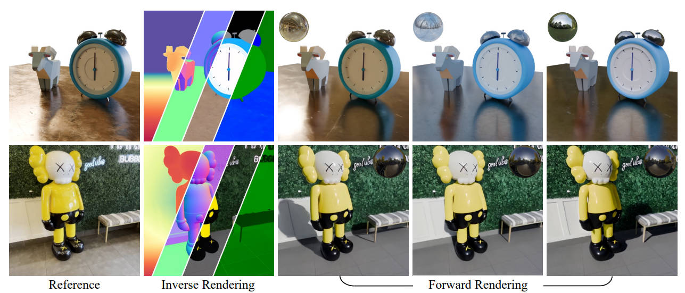

# DiffusionRenderer: Neural Inverse and Forward Rendering with Video Diffusion Models



[Ruofan Liang](https://www.cs.toronto.edu/~ruofan/)\*, [Zan Gojcic](https://zgojcic.github.io/), [Huan Ling](https://www.cs.toronto.edu/~linghuan/),  [Jacob Munkberg](https://research.nvidia.com/person/jacob-munkberg), [Jon Hasselgren](https://research.nvidia.com/person/jon-hasselgren), [Zhi-Hao Lin](https://chih-hao-lin.github.io/), [Jun Gao](https://www.cs.toronto.edu/~jungao/), [Alexander Keller](https://research.nvidia.com/person/alex-keller), [Nandita Vijaykumar](https://www.cs.toronto.edu/~nandita/), [Sanja Fidler](https://www.cs.toronto.edu/~fidler/),   [Zian Wang](https://www.cs.toronto.edu/~zianwang/)\*

\* indicates equal contribution

**[Paper](https://arxiv.org/abs/2501.18590) | [Project Page](https://research.nvidia.com/labs/toronto-ai/DiffusionRenderer/)**

**Overview.**
DiffusionRenderer is a general-purpose framework that achieves high-quality geometry and material estimation from real-world videos (inverse rendering), and photorealistic image/video synthesis from G-buffers and lighting (forward rendering). Both the inverse and forward renderers are video diffusion models trained on a combination of curated synthetic datasets and auto-labeled real-world videos.
Unlike classic PBR, which relies on precise geometry and path tracing, DiffusionRenderer provides a data-driven approximation of light transport through video GenAI models. It synthesizes realistic lighting effects without explicit simulation, complementing PBR for real-world applications such as relighting and material editing, especially when explicit geometry is inaccessible or inaccurate.

## Installation

### Conda environment

Create an new environment with conda, and install pytorch. We tested with pytorch version 2.1~2.4.

```bash
conda create -n diffusion_renderer python=3.10
conda activate diffusion_renderer

pip install torch==2.4.1 torchaudio==2.4.1 --index-url https://download.pytorch.org/whl/cu121

```

Install other project specific dependencies as follows

```bash
# Install required packages
pip install -r requirements.txt
```

## Model Weights

The model weights are available on [Hugging Face](https://huggingface.co/collections/nexuslrf/diffusionrenderer-svd-68472d636e85c29b6c25422f).
We provide 3 checkpoints:

| Checkpoints                                                                                                                | Description                                                           |
| -------------------------------------------------------------------------------------------------------------------------- | --------------------------------------------------------------------- |
| [nexuslrf/diffusion_renderer-inverse-svd](https://huggingface.co/nexuslrf/diffusion_renderer-inverse-svd)                     | Inverse Rendering Model                                               |
| [nexuslrf/diffusion_renderer-forward-svd-objaverse](https://huggingface.co/nexuslrf/diffusion_renderer-forward-svd-objaverse) | Forward Rendering Model (only trained on synthetic data)              |
| [nexuslrf/diffusion_renderer-forward-svd](https://huggingface.co/nexuslrf/diffusion_renderer-forward-svd)                     | Forward Rendering Model (synthetic + auto-labeled real data, w/ LoRA) |

You can download model weights by running the following command:

```bash
python utils/download_weights.py --repo_id nexuslrf/diffusion_renderer-inverse-svd
python utils/download_weights.py --repo_id nexuslrf/diffusion_renderer-forward-svd
python utils/download_weights.py --repo_id nexuslrf/diffusion_renderer-forward-svd-objaverse
```

## Running inference

You can jump to the [Demo](#demo-example) section for a quick start.

### Inference of the Video Inverse Rendering (De-lighting) Model

This script estimates 2.5D attributes on video frames.

By default, this script takes groups image frames in the same folder as one video sample.
For example, one possible way to organize the videos can be

```angular2html
inference_input_dir/
├── video_1/
│   ├── frame000.png/
│   ├── frame001.png/
│   ├── frame002.png/
│   ├── ...
│   └── frame023.png/
│
├── video_2/...
...
└── video_n/...
```

The inference script can run with the following command with python file `inference_svd_rgbx.py`:

```angular2html
python inference_svd_rgbx.py --config configs/rgbx_inference.yaml \
  inference_input_dir="/path/to/input_videos" \
  inference_save_dir="output_inference_delighting/" \
  inference_n_frames=24 inference_n_steps=20 model_passes="['basecolor','normal','depth','diffuse_albedo']" inference_res="[512,512]" 
```

The config system of this script is based on omegaconf, and the full list of arguments can be found in `configs/rgbx_inference.yaml`.
Here are some more explanation on the arguments in the command line:

- `inference_input_dir` specifies the directory to a folder with images for inference.
- `inference_save_dir` specifies the directory to a output inference results.
- `model_passes`: the passes to inference, more passes increase the inference time, recommend to specify as needed.
- `inference_n_frames`: the number of frames to run video inference.
- `inference_n_steps`: the number of denoising steps to run the video model.
- `chunk_mode`: the default setting is `first`, which only run inference on the first batch of frames within each folder. Change to `all` for inference on all frames. By default, the model repeat the last frame if there's not enough frames in a batch, set to `drop_last` to skip last batch with insufficient frames.

It implements distributed inference across videos, if you have many videos for inference, running on a multi-gpu machine can be helpful.

### Inference of the Video Forward Rendering (Re-lighting) Model

The forward renderer can execute based on the estimated scene attributes of the inverse rendering model.
The G-buffer file format by default follows the `webdataset` convention, and is automatically handled if using the inverse rendering model.

For example, assuming the delighting result is saved in `output_inference_delighting/`,
the inference script can run with the following command with python file `inference_svd_xrgb.py`:

```angular2html
python inference_svd_xrgb.py --config configs/xrgb_inference.yaml \
  inference_input_dir="output_inference_delighting/" \
  inference_save_dir="output_inference_relighting/" \
  inference_n_frames=24 inference_n_steps=20 inference_res="[512,512]" \
  lora_scale=0.25 use_fixed_frame_ind=true  rotate_light=true  
```

`inference_input_dir` is the directory with G-buffer image sequences for inference.
If using custom G-buffers, check the output of the inverse rendering model for an example of the file structure.

The config system of this script is based on omegaconf, and the full list of arguments can be found in `configs/xrgb_inference.yaml`.

- `inference_save_dir` specifies the directory to output inference results.
- `inference_n_frames`: the number of frames to run video inference.
- `inference_n_steps`: the number of denoising steps to run the video model.
- `lora_scale`: the scale of LoRA. This LoRA is trained with real data, recommended scale: 0.0~0.5 (0.0 means no LoRA, good for synthetic objects).

### Demo Example

Here is a set of sample commands that runs delighting and relighting on a folder of mp4 videos:

```angular2html
export FOLDER_MP4_VIDEO=examples/videos/
export FOLDER_EXTRACTED_FRAMES=examples/input_video_frames/
export FRAME_RATE=6
export FOLDER_DELIGHTING_OUT=examples/output_delighting/
export FOLDER_RELIGHTING_OUT=examples/output_relighting/

# 0. prepare frames (optional)
python utils/dataproc_extract_frames_from_video.py --input_folder=$FOLDER_MP4_VIDEO --output_folder=$FOLDER_EXTRACTED_FRAMES --frame_rate=$FRAME_RATE

# 1. inverse rendering: currently chunk_mode=first only run the first batch (24 frames) of the video, set to all will run the full video
python inference_svd_rgbx.py --config configs/rgbx_inference.yaml inference_input_dir=$FOLDER_EXTRACTED_FRAMES inference_save_dir=$FOLDER_DELIGHTING_OUT chunk_mode=first save_video_fps=$FRAME_RATE
ls $FOLDER_DELIGHTING_OUT/

# 2.1 forward rendering (option 1): use all frames, static light
python inference_svd_xrgb.py --config configs/xrgb_inference.yaml use_fixed_frame_ind=false  rotate_light=false lora_scale=0.0  save_video_fps=$FRAME_RATE inference_input_dir=$FOLDER_DELIGHTING_OUT inference_save_dir=$FOLDER_RELIGHTING_OUT/dynamic_frame_static_light

# 2.2 forward rendering (option 2): use the first frame, rotate light
python inference_svd_xrgb.py --config configs/xrgb_inference.yaml use_fixed_frame_ind=true  rotate_light=true lora_scale=0.0 save_video_fps=$FRAME_RATE inference_input_dir=$FOLDER_DELIGHTING_OUT inference_save_dir=$FOLDER_RELIGHTING_OUT/static_frame_rotate_light

# results of relighting is saved here:  
ls $FOLDER_RELIGHTING_OUT/*
```

Model loading at first time is often slower.
In the above example, inverse rendering takes ~2min (inference of 5 passes of scene attributes).
Forward rendering takes ~3min (inference of 4 different lighting conditions).

## Other information

### Run time statistics

The inference code was initially tested on A100 (80 GB) GPUs.
For 512*512 resolution and 24-frame video, 20 denoising steps:

- Inverse renderer takes 9.7 seconds
- Forward renderer takes 20.3 seconds (the overhead comes from the VAE encoding of more condition signals, with more proper parallelization it should be similar to inverse renderer)

The inference code can also run on RTX 4090 (24 GB) GPUs with additional memory saving options (which are enabled by default in provided yaml configs).

- `model_dtype: fp16`, using fp16 mixed precision for model weights.
- `decode_chunk_size: 8`, decoding the VAE in chunks to save memory, it might slightly hurt temporal consistency.

After applying these options, model inference still requires over 22 GB of GPU memory. 

Lower tier GPUs may be able to run by offloading some of the model weights to CPU (e.g., `pipeline.enable_model_cpu_offload()`), but this is not recommended.

## Acknowledgements

Our model is based on [Stable Video Diffusion](https://huggingface.co/stabilityai/stable-video-diffusion-img2vid) from Stability AI.

The Stability AI Model is licensed under the [Stability AI Community License](https://huggingface.co/stabilityai/stable-video-diffusion-img2vid-xt/blob/main/LICENSE.md), Copyright &copy; Stability AI Ltd. All Rights Reserved

## License

Copyright &copy; 2025, NVIDIA Corporation & affiliates. All rights reserved.

The source code and model are made available under
the [Nvidia Source Code License](https://github.com/nv-tlabs/diffusion-renderer/blob/main/LICENSE.txt)
.

## Citation

If you find this work useful, please consider citing:

```bibtex
@inproceedings{DiffusionRenderer,
    author = {Ruofan Liang and Zan Gojcic and Huan Ling and Jacob Munkberg and 
        Jon Hasselgren and Zhi-Hao Lin and Jun Gao and Alexander Keller and 
        Nandita Vijaykumar and Sanja Fidler and Zian Wang},
    title = {DiffusionRenderer: Neural Inverse and Forward Rendering with Video Diffusion Models},
    booktitle = {The IEEE Conference on Computer Vision and Pattern Recognition (CVPR)},
    month = {June},
    year = {2025}
}
```
